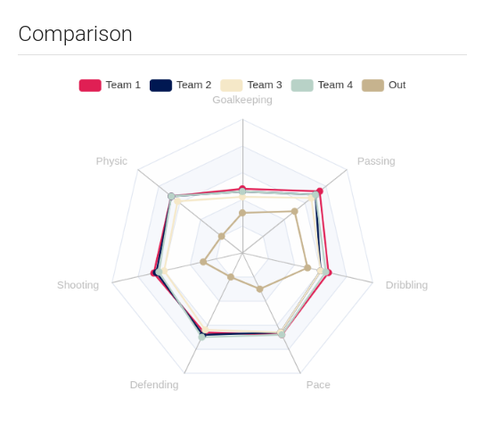
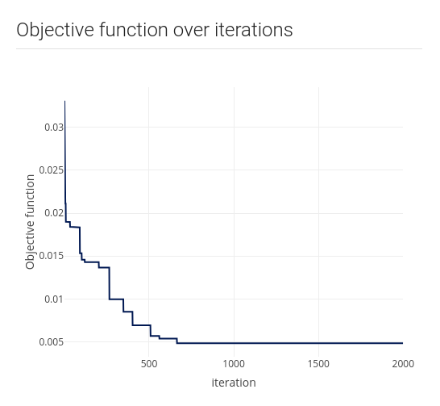

# FairSplit

## Links

+ Live version: [FairSplit - Live app](https://voronoys.shinyapps.io/fairsplit/)
+ RStudio cloud: [FairSplit - RStudio cloud](https://rstudio.cloud/project/2544357)
+ GitHub: [FairSplit - Github](https://github.com/voronoys/fairsplit)

## About the app

Wouldn't it be nice to have an approach to fairly split teams? We did it!

## Quick reading: Highlights

Soccer is the most popular sport in Brazil and before every (non-professional)
match, a task is necessary: split the teams.  A common way to do it is to choose
as many captains as the number of teams. They have the role to select their
teams based on their previous knowledge about the players' skills. The algorithm
starts with one of these captains selecting one player among all available
ones. After that, it is time for the next captain to start selecting their team
and again another player is selected among all available players. The algorithm
keeps going until all the players are allocated to a team.

Usually, the last captain has a weaker team as the other captains have already
selected the best players before.  Also, the 'best player' can be someone good
in one specific position and the concept itself is completely subjective.  The
same situation is rapidly applicable to other sports as volleyball, handball,
basketball, eSports, and so on. However, the task of creating teams is not just
applied to sports. It is common to have teams in a company, for example. In such
a case, the teams are defined based on the needs of each project.

  </img>

## Algorithm

We implemented a simple and useful iterative method. For each individual, a set
of attributes is collected, and, based on them, teams are created ensuring that
the overall teams’ metrics are similar. To do so, individuals are divided into
teams and teams’ similarity is calculated. After this, new settings are proposed,
and we keep the one in which the similarity is the biggest.

As a result, we have competitive teams with similar characteristics which can
ensure a more enjoyable match.

In our app the user can specify algorithm parameters:

- Number of iterations
- Number of teams 
- Size of each team.

  </img>

## Examples

- Nossa Pelada: 

This example is based on a weekly match we usually had (before the COVID-19 era)
in Belo Horizonte, Brazil. People and attributes are real and based on my
perception.

- Fifa:

This example is based on FIFA 20 scouts. To make it simple we only selected
players from Barcelona, Juventus, Paris Saint-Germain, Real Madrid, Manchester
City, and Liverpool. Also, we only selected midfielders and attacking players.
  Source:
https://www.kaggle.com/stefanoleone992/fifa-20-complete-player-dataset?select=players_20.csv

- Pokémon:

We used the Pokémon dataset in the highcharts package. It has several Pokémon
and some characteristics.

Source: https://github.com/jbkunst/highcharter/blob/master/data/pokemon.rda

- Company:

Some data science skills from people in my company. 

- Rstudio:

A fake dataset simulating how we could split the RStudio team based on their
knowledge about some R packages. The attributes are completely random.

- Upload your own data:

Try yourself!
 
Download our template and fill it with your data and split your teams.

## Preview

  </img>

